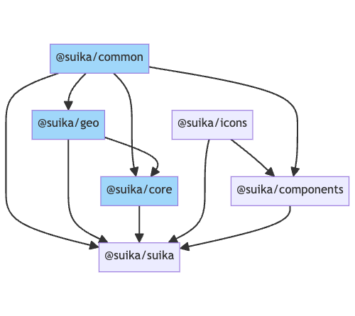

# 包的依赖关系

Suika 项目使用了 monorepo 的方式进行开发，这是为了通过物理隔离的方式，强制对几个模块进行解耦。

编辑器内核相关包：

- `@suika/common`：放一些其他包都可以使用的共享方法；
- `@suika/geo`：平面几何算法引擎，如判断点是否在多边形内；
- `@suika/core`：编辑器内核，编辑器核心

UI 层使用了 React，相关包为：

- `@suika/icons`：React 图标组件库；
- `@suika/components`：React 通用组件库，比如图标按钮，目前组件并不多；
- `@suika/suika`：编辑器 UI，完整版的图形编辑器

`@suika/suika` 把这些包整合在一起，得到最终的编辑器应用产物。

各包之间的依赖关系：

<!-- [](https://mermaid.live/edit#pako:eNp1ks1SgzAUhV-lc91SIAESYOHY350rXSldpCRARiAMBLV2-u4G2ip2RphhOOc73EtucoRUcQExZKX6SAvW6tnzOqln5lq8PnS9fGNOqqpK1bvZfH4_W17NXKjdJTeC1W-6FReyPJNpbD0lF7E6i2uB8XmpsLmaMlV1t5t-tZ38XqNqUeu_fDOK7bS5EWfZ6UMpjJnJsozvFu6abhdTsvyXrG7IcIMFlWgrJrmZ43FIJ6ALUYkEYvPKRcb6UieQ1CcTZb1WT4c6hVi3vbCgVX1eQJyxsjOqbzjTYi1Z3rLqxt1wqVX7Y5aKcWHkEfShGbYwl502DcykMpkPft-Wxi60brrYcQZs51IX_d42M3M6yYf9Lt4j4hBMQoY9QajHAs_j6R5FYYZ9lHHqIszgdLJAjP0fz-dlPDYWNKweOn1CTLDtRz4iQUiQj7GHLThAjJBrB5Qi4vpBFNCQYlPoSymzNtcO_YggNwj8AFOKQ28s9zLCcY2nb4_fx-4) -->

## 替换 UI 层

如果你要使用自己的 UI 框架，比如 Vue。

你需要实现一个类似 `@suika/suika` 的 Vue 项目包，然后引入 `@suika/core` 包。

甚至可以不需要 UI 层。

因为编辑器自身的状态只在编辑器内核中维护，UI 层只是将状态同步然后显示出来而已，所以不用担心剥离 UI 层会导致编辑器内核无法工作。